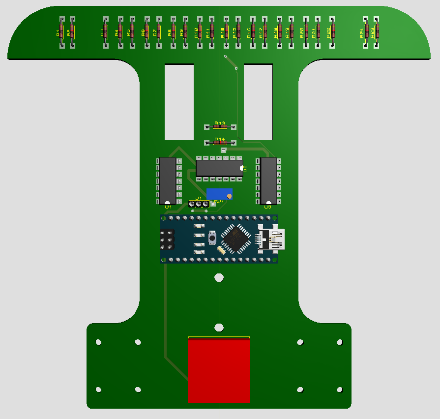
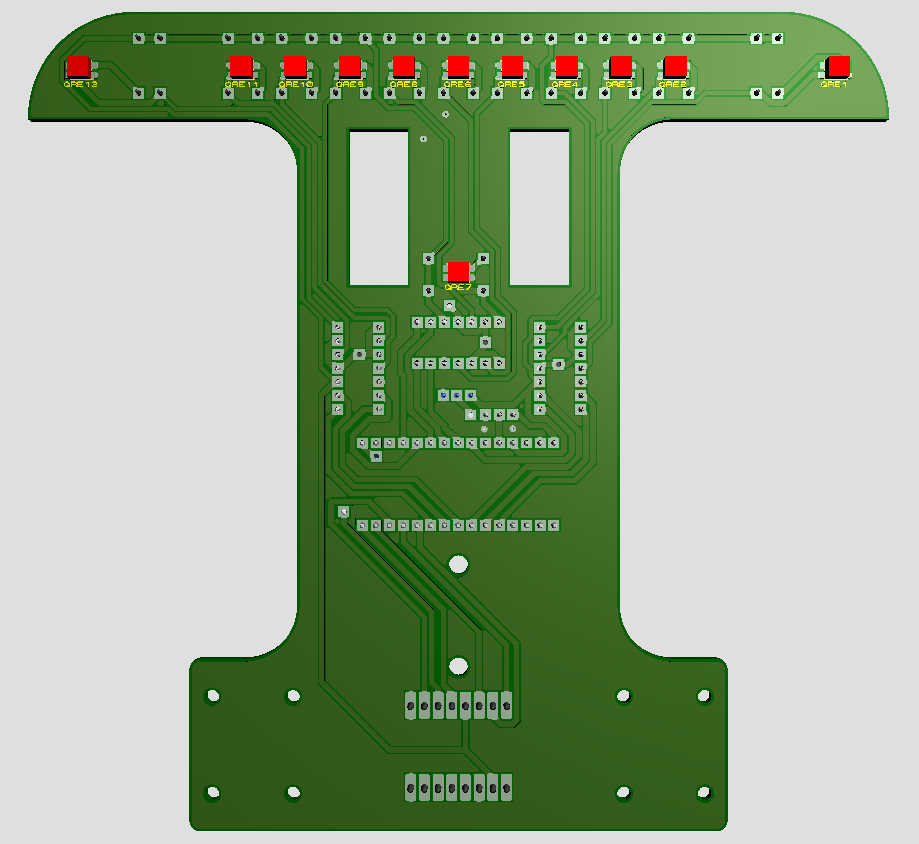
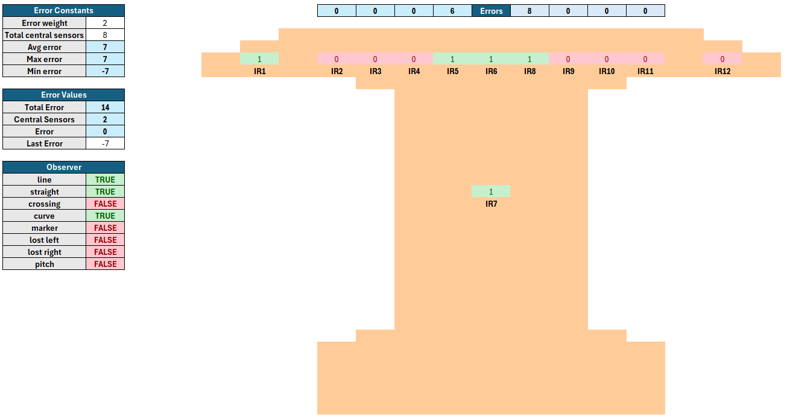
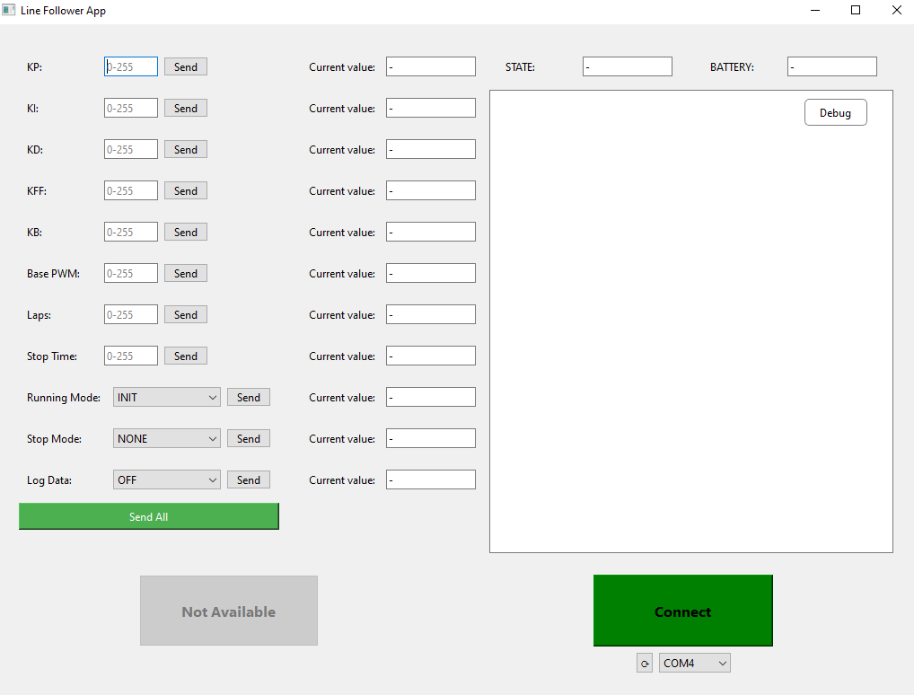

# Line Follower Robot

This project implements a line-follower robot using an Arduino as the controller and `IR` sensors for vision. The robot uses a `PID` controller to adjust motor speeds and maintain its position on the line. The project is written in C, but made to be compatible with the structure required by the `Arduino IDE/CLI`.

<div align="center">
  
</div>

## Contents

- [Features](#features)
- [Hardware Setup](#hardware-setup)
- [Project Structure](#project-structure)
  - [Key Components](#key-components)
- [Code Style and Compatibility](#code-style-and-compatibility)
- [How It Works](#how-it-works)
  - [Debugging](#debugging)
  - [Serial Communication](#serial-communication)
  - [Initialization](#initialization)
  - [State Machine](#state-machine)
  - [Main Loop](#main-loop)
  - [Track Mapping](#track-mapping)
  - [Stopping](#stopping)

## Features

- **IR Sensor Vision**: Reads data from `IR` sensors and tracks line markers, curves, crossings and other environmental features.
- **PID Controller**: Implements a Proportional-Integral-Derivative (`PID`) controller for precise motor control.
- **Hardware Abstraction Layer (HAL)**: Provides low-level interaction with `AVR` registers and hardware components.
- **Logger**: Outputs debugging information via `USART` for monitoring and diagnostics.
- **Timer**: Manages system time and provides helper functions for time-based operations.
- **State Machine**: Implements a state machine for managing robot states and transitions.
- **Bluetooth Communication**: Allows for remote control and monitoring of the robot's state via Bluetooth.

## Hardware Setup

The robot uses 12 `IR` (infrared `QRE1113`) sensors for position detection, where:

- 1 extreme left sensor to detect curve markers.
- 1 extreme right sensor to detect start/stop markers.
- 1 middle sensor in the center of the board for alignment detection.
- 9 central sensors for line tracking.

| Top View                                                                   | Bottom View                                                                      |
| -------------------------------------------------------------------------- | -------------------------------------------------------------------------------- |
|  |  |

Since the sensors are analog and Arduino uses mostly digital pins, the sensors are first connected to an `OpAmp` (Operational Amplifier `LM339`) using a comparator circuit configuration, with the reference signal from a variable resistor that can be manually adjusted. This way the comparator threshold can be adjusted to adapt to different lighting conditions, surface colors, and sensor distances.

The `OpAmp` output is then connected to the Arduino's digital pins, which read the sensor data and its internal algorithms to determine the robot's position relative to the line.

The motors are controlled using `PWM` (Pulse Width Modulation) signals, which are generated by the Arduino's digital pins. The motor driver circuit (`TB6612FNG`) uses both the `PWM` signal pins, as well as the direction control pins to determine the speed and direction of the motors.

The drivers themselves are also placed in a way as to allow multiple driver stacking, so that the resulting current going though each individual driver is lower, allowing for more overall power to be sent to the motors without compromising driver integrity.

There is also one analog pin connected to the battery connector, which is used to measure the battery voltage and determine the battery level, using the Arduino's internal `ADC` (Analog to Digital Converter). This allows for dynamic adjustments to motor speed, depending on the battery level, allowing for more consistent performance.

The robot also uses a `HC-05` Bluetooth module for remote control and monitoring. The module is connected to the Arduino's `USART` pins, allowing for communication with a smartphone or other Bluetooth-enabled device. This allows for remote control of the robot, as well as monitoring of its state and performance.

## Project Structure

```plaintext
line_follower
├── docs/               # Documentation files
├── include/            # Header files
│   ├── battery/        # Battery monitoring module
│   ├── hal/            # Hardware Abstraction Layer
│   ├── logger/         # Logger module
│   ├── pid/            # PID controller module
│   ├── receiver/       # Serial receiver module
│   ├── state_machine/  # State machine module
│   ├── timer/          # Timer module
│   ├── vision/         # Vision module
│   └── config.h        # Configuration file
├── src/                # Implementation files
└── line_follower.ino   # Entry point for Arduino compliance
```

The project is structured to be compatible with the `Arduino IDE/CLI`, which requires a specific file structure for compilation and upload. The main entry point is `line_follower.ino`, which includes the necessary headers, initializes the robot and runs the main loop. Also the `include` and `src` directories need to be located at the root level of the project for the `Arduino IDE/CLI` to recognize them correctly, which is the reason for not having specific `src` and `include` dirs for each individual module. This also means that the `include` and `src` directories mirror each other for better organization, with header files in [include](include) and their corresponding implementations in [src](src).

For better compatibility with the `Arduino IDE/CLI`, the project uses `.cpp` files for implementation, but no `C++`-specific features are utilized, having the entire codebase written in `C`.

Also the [config file](include/config.h) contains all the configuration macros for the project, including the `DEBUG_MODE` macro to enable/disable the logger module, as well as other general build and operation options that can be chosen. This allows for easy customization of the project without having to modify the code itself.

### Key Components

1. **Battery**

   This module monitors the battery voltage and provides functions to read the battery level. It uses an `ADC` (Analog to Digital Converter) to read the voltage level and can operate on demand or periodically, depending on the mode selected. The battery level can be used to adjust the motor speed and ensure consistent performance, as well as to determine when the battery needs to be recharged. It can be found in [battery](include/battery) and [battery](src/battery).

2. **HAL (Hardware Abstraction Layer)**

   Located in [hal](include/hal) and [hal](src/hal), this module interacts with `AVR` registers and hardware components such as motors and `IR` sensors, separating hardware-specific code from the main logic. It provides functions to read sensor data, control motors, manage `PWM` signals, setup the `ADC`, control timers, and interact with `USART`.

3. **Logger**

   The logger module, found in [logger](include/logger) and [logger](src/logger), uses `USART` for debugging and diagnostics. It provides functions to print sensor states, errors, and other runtime information. Can be enabled/disabled by setting the `DEBUG_MODE` macro in [config.h](include/config.h). The logger module also contains all the serial messages sent for the control and monitoring protocol used by the robot, which can be used to communicate with the robot via `Bluetooth` or `USART`. This allows for remote control and monitoring of the robot's state and performance.

4. **PID Controller**

   The `PID` controller, implemented in [pid](include/pid) and [pid](src/pid), calculates motor speed adjustments based on sensor data to keep the robot on the line. It error functions based on sensor data to calculate the error values to be used in the `PID` controller. The `PID` controller uses the error values to calculate the motor speed adjustments, which are then sent to the motor driver circuit through the actuator logic. This is split into two main PID controllers, one that uses all `PID` terms to determine the delta speed of each motor, and another that uses `P` implemented as a brake factor and `FF` (feedforward) terms to determine the base speed of the motors. This allows for safer turns and more precise control on mapped environments.

5. **Receiver**

   Similar to the logger module, the receiver module, located in [receiver](include/receiver) and [receiver](src/receiver), uses `USART` for communication with the robot. It provides functions to receive commands and data from a remote device, such as a smartphone or computer. This allows for remote control of the robot, as well as monitoring of its state and performance. The receiver module also contains all the serial messages sent for the control and monitoring protocol used by the robot, which can be used to communicate with the robot via `Bluetooth` or `USART`. This allows for remote control and monitoring of the robot's state and performance. Can be especially useful for mapping the track and calibrating `PID` parameters.

6. **State Machine**

   This is the main module that manages the robot's states and transitions. It controls the robot's behavior and is responsible for managing the entire operation. It controls `PID` and `PWM` configurations, as well as interacts with all actuator modules, to determine the robot's behavior. The state machine is implemented in [state_machine](include/state_machine) and [state_machine](src/state_machine). It has the following states:

   - `INIT`: The robot is initializing and setting up the system.
   - `IDLE`: The robot is idle and waiting for commands.
   - `RUNNING`: The robot is operating according to the selected RUNNING_MODE.
   - `STOPPED`: The robot has stopped and is cleaning up resources to restart operations.
   - `ERROR`: The robot has encountered an error and is in a safe state.

7. **Timer**

   The timer module, located in [timer](include/timer) and [timer](src/timer), manages system time and provides helper functions for time-based operations. It uses an `8-bit` timer since the `16-bit` timer is already in use for the `PWM` signal generation, and uses a precision of 1ms to establish a balance between precision control and number of interrupts needed for the timer to work. It also uses a `32-bit` variable to store the system time, which allows for a maximum time of 49 days before the timer overflows. This is done to allow for more precise control of the robot, as well as to offload heavy calculations to different frames, providing for more efficient use of the CPU.

8. **Vision**

   The vision module, found in [vision](include/vision) and [vision](src/vision), processes sensor data to detect environmental characteristics such as line markers, curves, and crossings. It uses the `IR` sensors to try and determine pre-define environmental characteristics based on expectations of the robot's behavior.

   There is also an interactive [spreadsheet](docs/Sensors%20Observer.xlsx) in the [docs](docs) directory with the expected environment identifications used by the robot, which can be used to test the robot's behavior in a simulated environment and to help consider the different scenarios that the robot may encounter.

   

   The spreadsheet shows the hardware layout for the robot, where each sensor can be individually activated and the error properties altered to simulate the robot's expected identification of the environment. There is also a Truth Table that shows the expected identifications based on all possible arrangements of the sensors, which can be used to better understand the logic behind the robot's behavior.

   The robot also uses [debounce timers and sensor logic](src/vision/track.cpp) to map the track without the use of an encoder. Which even though less precise than models that use an encoder, still allows for relative high precision when dividing the track into different sections for mapping expected control parameters and extracting the most of the robots performance during operation.

9. **Config**

   The config file in [config.h](include/config.h) contains all the configuration macros for the project, including the `DEBUG_MODE` macro to enable/disable the logger module, as well as other general build and operation options that can be chosen. This allows for easy customization of the project without having to modify the code itself.

## Code Style and Compatibility

- All code is written in `C` and implemented in `C++` files.
- The project uses `.cpp` files for implementation to comply with Arduino's file handling requirements, but no `C++`-specific features are used.
- The `include` and `src` directories mirror each other for better organization, with header files in `include` and their corresponding implementations in `src`.
- The codebase uses Doxygen-style comments for documentation, making it easier to generate documentation using tools like `Doxygen`.
- The project is designed to be compatible with the `Arduino IDE/CLI`, which requires a specific file structure for compilation and upload. The main entry point is `line_follower.ino`, which includes the necessary headers, initializes the robot, and runs the main loop.
- All major macro configurations are defined in the [config.h](include/config.h) file, allowing for easy customization of the project without modifying the code itself.
- The project uses snake_case for variables, functions, and files, while using PascalCase for structs and UPPERCASE for constants. Any additions to the code should follow this style for consistency.
- The project uses `AVR` specific libraries and functions, so it is not portable to other platforms without modification. However, the code is designed to be modular and can be easily adapted to other platforms by replacing the `HAL` module with platform-specific code.

## How It Works

### Debugging

The `DEBUG_MODE` macro can be enabled/disabled in [config.h](include/config.h) to log operation and error data via USART. This should be disabled for actual operation to avoid performance issues, as the debug functions consume a significant amount of the available memory and CPU resources. The logger module uses `USART` to send messages to a connected serial device, such as a computer or smartphone, allowing for real-time monitoring of the robot's state and performance.

### Serial Communication

The robot uses `USART` for serial communication, allowing for remote control and monitoring. The `HC-05` Bluetooth module is connected to the Arduino's `USART` pins, enabling communication with a smartphone or other Bluetooth-enabled device. To enable this there is a predefined protocol for communication, that defines the commands and data formats used by the robot.

The communication protocol is implemented in two parts: the logger responsible for messages sent by the robot, and the receiver that handle messages received, which can be found in their respective modules. This means that any messaging service that uses the same serial configuration can be used to control and monitor operation. However there is also an [app](https://github.com/l1h2/line_follower_app_dsk) already made for this purpose, which already encompasses all the main functionality needed.



For more information on the app, please refer to the [app repository](https://github.com/l1h2/line_follower_app_dsk).

The robot can also send realtime sensor data through the serial connection, allowing for track mapping, and logging of operation data. This is done in an optimized manner, by signalling the receiver to start receiving binary data, and all following data will be compressed into two bytes, until the stop signal is sent and normal communication resumes. This allows for critical data to be sent without compromising `PID` or other operation critical frames, as the serial communication is generally slow due to limitations with the `BAUD_RATE`. This functionality is disabled by default, but can be enabled by the receiver, by sending the `LOG_DATA` command.

The remote control module can also be disabled by commenting out the `BLUETOOTH_MODE` macro in [config.h](include/config.h). This will disable all protocol messages, and change the `IDLE` state in the state machine to not wait for commands, but instead setup operation with the default parameters. This allows for the robot to be used without the need for a remote control device, and can be useful for testing and debugging purposes.

### Initialization

The [`setup()`](line_follower.ino) function initializes critical system resources, such as the system timer, `USART` for the serial communication protocol, and the `ADC` hardware for battery monitoring. For specific uses of hardware, such as `PWM`, the modules that use them are responsible for handling initialization and interaction with the `HAL`. This is done to increase battery life, by not initializing hardware that is not needed for the current operation.

### State Machine

The state machine is initialized in the [`main()`](line_follower.ino) function and is used to manage the robot's states and transitions. It controls the robot's behavior and is responsible for managing the entire operation. It controls `PID` and `PWM` configurations, as well as interacts with all actuator modules, to determine the robot's behavior. It has the following states:

- `INIT`: The robot is initializing and setting up the system. This happens only once when the state machine is first initialized. From this state it can only transition to the `IDLE` state.

- `IDLE`: The robot is idle and waiting for commands to define operation parameters, such as the `RUNNING_MODE` and `STOP_MODE`. If the `BLUETOOTH_MODE` macro is enabled the robot will wait for commands to be received via `USART`, including the `START` command to transition to the `RUNNING` state. In this state the robot will also periodically broadcast all its parameters, including the battery level and `PID` variables, to the connected device. This allows for remote monitoring of the robot's state and performance.

  If the `BLUETOOTH_MODE` macro is disabled, the robot will automatically transition to the `RUNNING` state after a short delay and setting up the default operation parameters.

  From this state it can only transition to the `RUNNING` state.

- `RUNNING`: The robot is operating according to the selected `RUNNING_MODE`, such as `SENSOR_TEST` or following the `PID` controller. The main operation loop is executed in this state, where the robot reads sensor data, calculates motor speed adjustments, and sends commands to the motor driver circuit. The robot can also receive commands from the remote control device to change operation parameters or stop operation.

  From this state it can transition to the `STOPPED` if operation is finished or back to the `IDLE` state if operation is paused or interrupted.

- `STOPPED`: The robot has stopped and is cleaning up resources to restart operations, such as resetting state machine variables and clearing sensor memory data. This state is used to stop the robot and clean up resources before transitioning back to the `IDLE` state. From this state it can only transition back to the `IDLE` state completing an operation cycle.

- `ERROR`: The robot has encountered an error and is in a safe state. This state is used to handle errors and exceptions that may occur during operation, such as hardware failures or unexpected behavior. The robot will stop operation and enter a safe state until manually reset. This state can be triggered by any other state, when a critical error is detected. The robot will not transition out of this state, as to avoid persistence of critical errors, and if the robot ever enters this state it is recommended to review the implemented code and hardware components to determine the cause of the error before restarting operations.

### Main Loop

The `main()` loop in the `RUNNING` state of the state machine continuously updates the `PID` controller and checks for stop conditions. Sensor data is processed, and motor speeds are adjusted to keep the robot on the line.

The exact behavior of the robot in this state is determined by the `RUNNING_MODE` set in the state machine, which can be changed to different modes of operation:

- Base PID

  The loop works in a frame based manner, where each event has its own frame interval for performing calculations based on the running system timmer. This is done to allow for more precise control of the robot, as well as offloading heavy calculations to different frames, providing for more efficient use of the CPU.

  It uses a `PID` controller to adjust the delta `PWM` values that need to be applied to each motor, allowing for it to turn and follow the line. The `PID` controller uses the error values calculated from the sensor data to determine the motor speed adjustments, which are then sent to the motor driver circuit through the actuator logic.

  It also uses a second controller to adjust the base `PWM` value for each motor, which is used to determine the base speed of the motors. This is done to allow for safer turns and more precise control when high instability is detected. For that, the controller uses a `P` component tied to the same error function as the delta `PID` controller, but it also has a `FF` (feedforward) component that can be used to map different tracks. This is done so that the robot can perform optimally in different sections of the same track, without compromising safety on more unstable sections.

  When transitioning from this mode to the `STOPPED` state, the robot will gradually reduce the max `PWM` value in small intervals until it reaches `0`, at which point the robot stops. This is done to allow for a more gradual stop, as well as to allow for the robot to stop in a more controlled manner, preventing it from stopping abruptly.

  This mode is the default mode of operation, and is used for most of the robot's operation.

- Sensor Test

  This mode is used to test the sensors and their behavior. It logs operation data and error function calculations. This mode can be used to map the hardware to the corresponding logic and to verify the integrity of hardware components. It can also be used to test the robot's behavior in different environments, such as different lighting conditions or surface colors.

In all modes the entire execution loop is managed by the state machine and no other code can run while the state machine has control of the robot's operation. This is done to prevent any other code from interfering with the robot's operation, as well as to allow for more precise control of the robot.

### Track Mapping

The robot uses [debounce timers and sensor logic](src/vision/track.cpp) to map the track without the use of an encoder. While not as precise as models that use an encoder, this still allows for sectioning of the track into multiple sectors for mapping expected control parameters and extracting the most of the robot's performance during operation.

This can be used to detect tight curves and long straights, which in turn can be used to adjust the base speed `FF` term to optimize track traversal in these sections. This is done in two parts:

- Track mapping: The different tracks mapped by the robot can be configured in [vision/tracks](src/vision/tracks), where the different markers identified by the track logic can be used to determine the corresponding track section the robot is currently in.

- Feedforward adjustment: In [pid/tracks](src/pid/tracks) the `FF` term can be adjusted based on the track section the robot is currently in. This allows for the robot to speed up or slow down, based on the predefined track sections. With this the individual sections don't need to be adjusted manually when testing different base speeds, as adjusting only the gain `KFF` for the feedforward term will automatically adjust the base speed for each section. Consequently, track mapping can also be disabled simply by setting the `KFF` gain to `0`, which will disable the feedforward term and make the robot operate with only the `PID` controller.

The track selection can be found in [vision_base.h](include/vision/vision_base.h), where the different tracks are also defined.

### Stopping

The robot stops when reaching the `STOPPED` state in the state machine after completing the specified number of laps. At this moment the state machine can also terminate operations and allows for other code to run, if needed.
